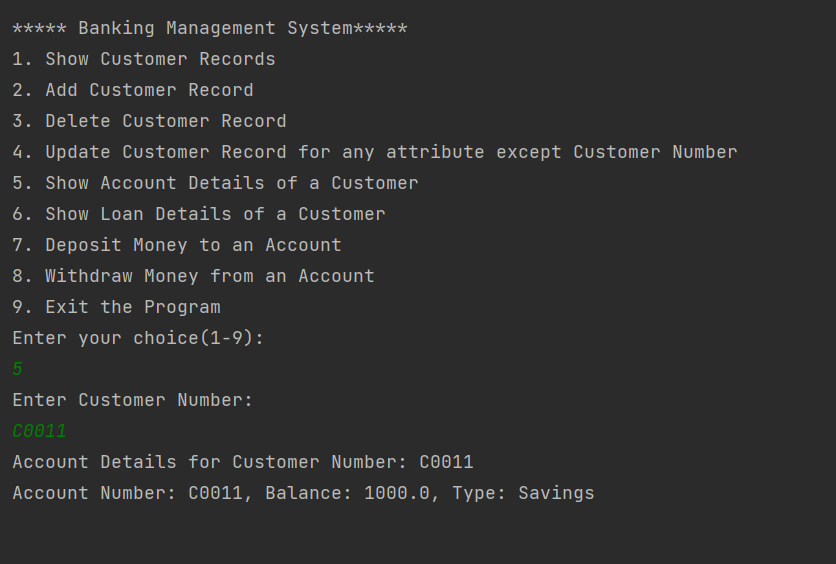
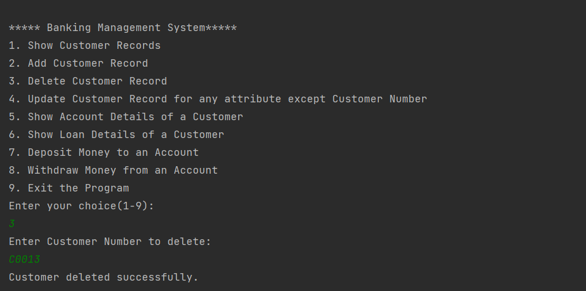
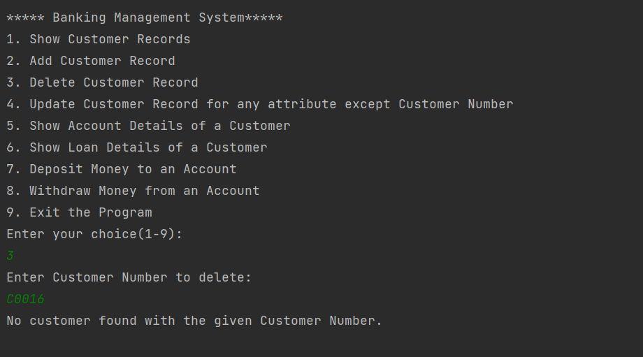
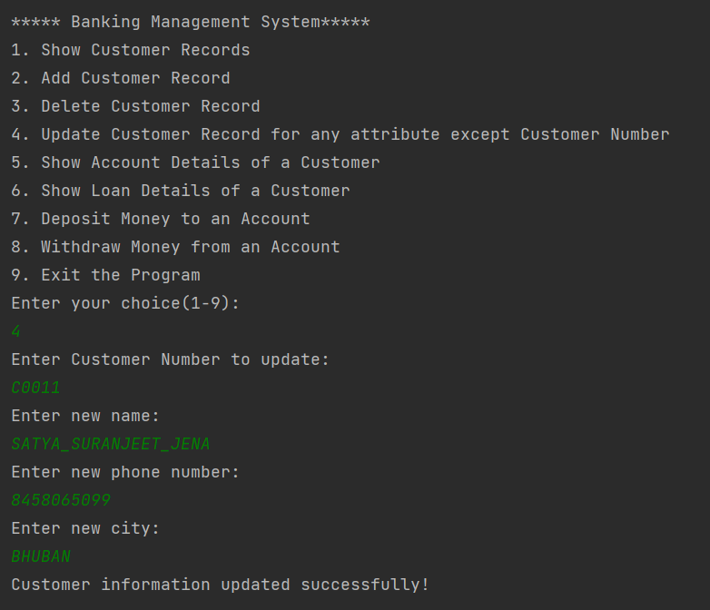
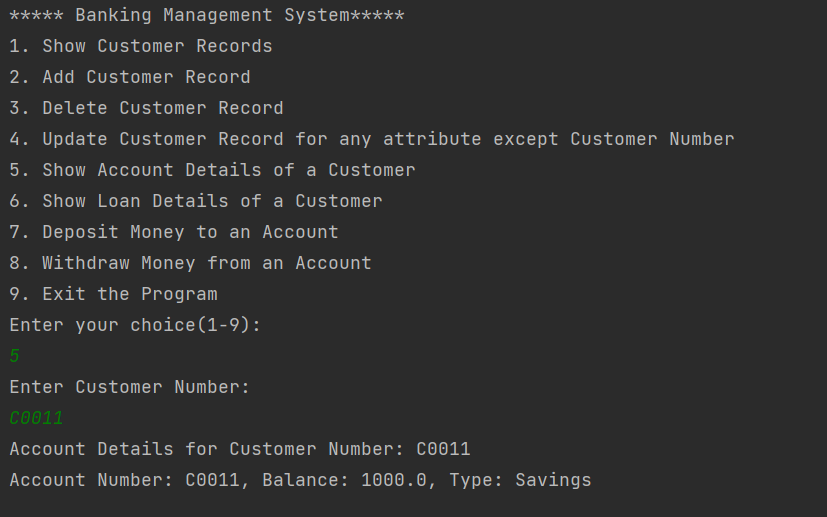

<body>
    <h1>Customer Management System</h1>

    <h2>Description</h2>
    
The Customer Management System is a Java-based application that provides an interface for users to manage customer records in an Oracle SQL database. The program supports operations such as displaying, adding, deleting, and updating customer records, as well as managing account and loan details. All interactions are handled through a menu-driven interface, with outputs displayed in a user-friendly format.

    <h2>Features</h2>
    <ol>
        <li><strong>Show Customer Records</strong>: Display all customer details in a formatted manner.</li>
        <li><strong>Add Customer Record</strong>: Add a new customer by providing <code>cust_no</code>, <code>name</code>, <code>phoneno</code>, and <code>city</code>. Display updated customer records.</li>
        <li><strong>Delete Customer Record</strong>: Delete a customer by providing <code>cust_no</code>. Display updated customer records.</li>
        <li><strong>Update Customer Information</strong>: Update customer information by providing <code>cust_no</code> and choosing from:
            <ul>
                <li>Update name</li>
                <li>Update phone number</li>
                <li>Update city</li>
            </ul>
            Display updated customer records.
        </li>
        <li><strong>Show Account Details of a Customer</strong>: Display account details by providing <code>cust_no</code>.</li>
        <li><strong>Show Loan Details of a Customer</strong>: Display loan details by providing <code>cust_no</code>.</li>
        <li><strong>Deposit Money to an Account</strong>: Deposit money by providing the account number and amount. Display updated account details.</li>
        <li><strong>Withdraw Money from an Account</strong>: Withdraw money by providing the account number and amount. Display updated account details.</li>
        <li><strong>Exit the Program</strong>: Exit the application.</li>
    </ol>

    <h2>Prerequisites</h2>
    <ul>
        <li>Java Development Kit (JDK)</li>
        <li>Oracle SQL Database</li>
        <li>JDBC Driver for Oracle</li>
    </ul>

    <h2>Installation and Setup</h2>
    <ol>
        <li><strong>Clone the repository</strong>:
            <pre><code>git clone https://github.com/yourusername/CustomerManagementSystem.git
cd CustomerManagementSystem
            </code></pre>
        </li>
        <li><strong>Set up Oracle SQL Database</strong>: Create the necessary tables for customers, accounts, and loans.</li>
        <li><strong>Configure Database Connection</strong>: Update the database connection details in the Java code (e.g., URL, username, password).</li>
        <li><strong>Compile and Run the Program</strong>:
            <pre><code>javac CustomerManagementSystem.java
java CustomerManagementSystem
            </code></pre>
        </li>
    </ol>

    <h2>Usage</h2>
    
Run the program to display the menu with various operations. Choose an option and follow the prompts to provide the necessary information. The results will be displayed on the terminal screen.

    <h2>Exception Handling</h2>
    
The program includes exception handling to manage errors during database operations and user input.

    <h2>Example Output</h2>
    

    <pre><code>1. Show Customer Records
2. Add Customer Record
3. Delete Customer Record
4. Update Customer Information
5. Show Account Details of a Customer
6. Show Loan Details of a Customer
7. Deposit Money to an Account
8. Withdraw Money from an Account
9. Exit the Program

Enter your choice: 1
---------------------------------------
Customer Records:
Cust No | Name        | Phone No  | City
---------------------------------------
1       | John Doe    | 1234567890| New York
2       | Jane Smith  | 0987654321| Los Angeles
---------------------------------------
    </code></pre>

    <h2>Screenshots</h2>
    

    

    

    

    

    <h2>Author</h2>
    
<a href="https://github.com/yourusername">Your Name</a>

    <h2>License</h2>
    
This project is licensed under the MIT License - see the <a href="LICENSE">LICENSE</a> file for details.

    <h3>Instructions for Adding Screenshots</h3>
    <ol>
        <li><strong>Take a screenshot</strong> of your application's output.</li>
        <li><strong>Save the screenshot</strong> in the <code>screenshots</code> directory within your project directory.</li>
        <li><strong>Reference the screenshot</strong> in the README.md file as shown above.</li>
    </ol>
</body>